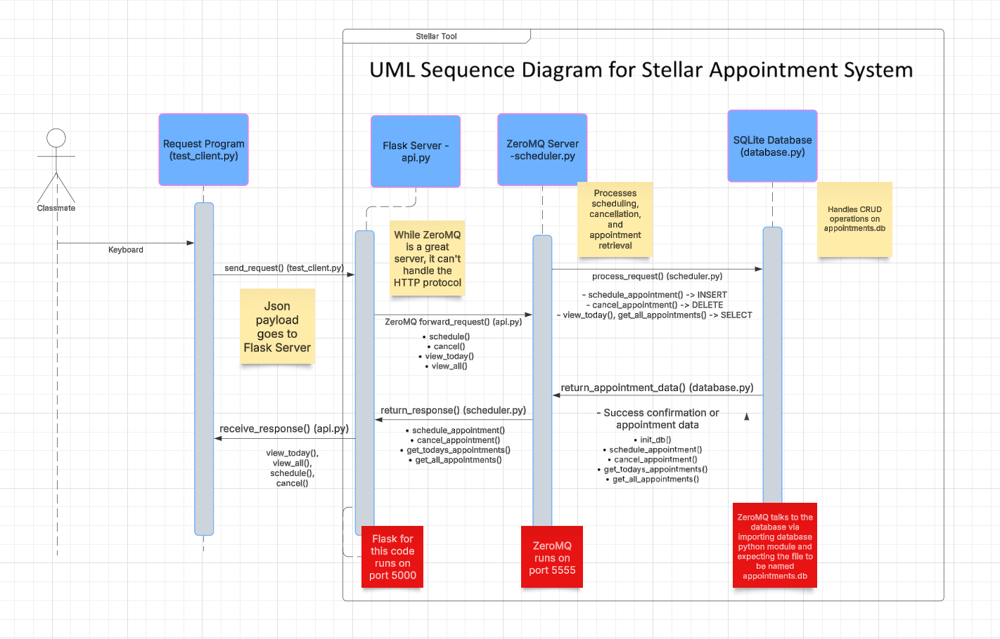
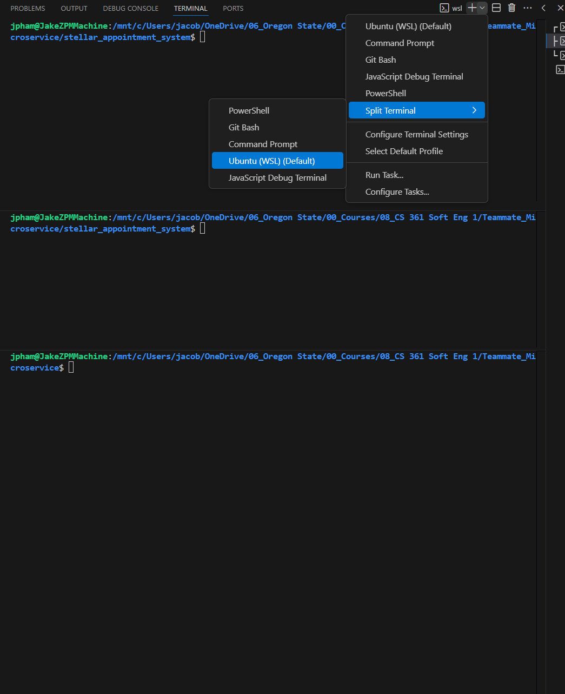

# Stellar Appointment System

This is a simple microservice that lets you schedule, cancel, and view appointments. It uses **ZeroMQ** for internal communication, **SQLite** for data storage, and exposes a lightweight **Flask API** so users can send requests using `curl`.

---

## 🎯 What Does This Do?
- ✅ **Schedule** an appointment by providing a name, date, and time.
- ❌ **Cancel** an appointment using its ID.
- 📅 **View today's appointments** to see your schedule.
- 📜 **View all appointments** across all dates.

## UML Diagram to understand the flow of the programs




You can send requests using simple `curl` commands and save responses directly into variables in your code.

---

## 📥 How to Get Started

### 1. Clone the Repository
```bash
git clone https://github.com/jphamgithub/stellar_appointment_system.git
cd stellar_appointment_system
```

### 2. Install Required Packages
Make sure Python 3.7+ is installed, then run:
```bash
pip install -r requirements.txt
```

You may need --break-system-packages
```bash
pip install -r requirements.txt --break-system-packages
```

If you want to be super safe, run a virtual environment 
```
python3 -m venv venv
source venv/bin/activate
```

### 2.5 Set up 3 terminals



### 3. Set Up the Database
Run this command to initialize the SQLite database:
```bash
python3 -c "import database; database.init_db()"
```

### 4. Run the Services
- 🔌 **Start the Microservice**:
```bash
#Open Terminal 1
python3 scheduler.py
```
- 🚀 **Run the Flask API** (in a separate terminal):
```bash
#Open Terminal 2
# ⚠️ WARNING: This server runs on port 5000 by default.
# I could change in a future revision or you could do find/replace across code base
# 💡 Reminder: Flask will show a warning that it's running in development mode.
# This is normal for local testing but should NOT be used for production deployment.
python3 api.py
```

##### **Quick Start with One Command**
Run both the Scheduler and Flask API simultaneously with the provided script:
```bash
# Make sure the script is executable
chmod +x runservice.sh

# Run both services at once
./runservice.sh
```

If you lose track of the PID's to kill, this will show you the PID's to kill
```
ps aux | grep python
```

---

## 🔗 How to Use `curl` and Save Responses

### 📅 1. Schedule an Appointment
Command:
```bash
curl -X POST http://localhost:5000/schedule   -H "Content-Type: application/json"   -d '{"patient": "John Doe", "date": "2025-02-10", "time": "14:30"}'
```

Save the response to a variable in bash:
```bash
RESPONSE=$(curl -s -X POST http://localhost:5000/schedule   -H "Content-Type: application/json"   -d '{"patient": "John Doe", "date": "2025-02-10", "time": "14:30"}')
echo $RESPONSE
```

### ❌ 2. Cancel an Appointment
Command:
```bash
curl -X POST http://localhost:5000/cancel   -H "Content-Type: application/json"   -d '{"appointment_id": 123}'
```

Save the response:
```bash
CANCEL_RESPONSE=$(curl -s -X POST http://localhost:5000/cancel   -H "Content-Type: application/json"   -d '{"appointment_id": 123}')
echo $CANCEL_RESPONSE
```

### 📋 3. View Today's Appointments
Command:
```bash
curl -X GET http://localhost:5000/view_today
```

Save the response:
```bash
TODAY_APPOINTMENTS=$(curl -s -X GET http://localhost:5000/view_today)
echo $TODAY_APPOINTMENTS
```

### 📜 4. View All Appointments
Command:
```bash
curl -X GET http://localhost:5000/view_all
# If you have jq installed to see it "prettier"
curl -X GET http://localhost:5000/view_all | jq '.'
```

Save the response:
```bash
ALL_APPOINTMENTS=$(curl -s -X GET http://localhost:5000/view_all)
echo $ALL_APPOINTMENTS
```

---
## How to use the Test Client to run all of the above using python code instead

1. **Start Services:**
   - Terminal 1: `python3 scheduler.py`
   - Terminal 2: `python3 api.py`

2. **Run the Test Client:**
   - Terminal 3: `python3 test_client.py`

Sample Output
```
jpham@JakeZPMMachine:$ python3 test_client.py 
Scheduling an appointment for John Doe on 2025-02-25 at 10:00 AM
{
    "appointment_id": 20,
    "status": "success"
}

Viewing today's appointments:
{
    "appointments": []
}

Viewing all scheduled appointments:
{
    "appointments": [
        {
            "date": "2025-02-25",
            "id": 20,
            "patient": "John Doe",
            "time": "10:00"
        }
    ]
}

 Canceling appointment with ID 20
{
    "message": "Appointment 20 canceled.",
    "status": "success"
}

Viewing all appointments after cancellation:
{
    "appointments": []
}
```

---
## 📂 Project Structure

```
stellar_appointment_system/
├── images                     # Image folder for README
├──── terminalsetup.png        # Image terminals
├──── UML_sequence_diagram.png # Image UML
├── .gitignore                 # ignore the db file, pycache and other files not to go to github
├── api.py                     # Flask API for easy request handling
├── database.py                # SQLite database functions
├── README.md                  # Project documentation (this file)
├── requirements.txt           # Required dependencies
├── runservice.sh              # set up services with 1 terminal
├── scheduler.py               # ZeroMQ server for handling appointmentse
└── test_client.py             # Test Client to run all code
```

---

## 🔨 How to Add New Functions

### 1. **In `database.py`**
- Define a function that interacts with the SQLite database.
- Example: To view all appointments:
```python
def get_all_appointments():
    conn = sqlite3.connect('appointments.db')
    c = conn.cursor()
    c.execute('SELECT id, patient, date, time FROM appointments')
    appointments = [{'id': row[0], 'patient': row[1], 'date': row[2], 'time': row[3]} for row in c.fetchall()]
    conn.close()
    return appointments
```

### 2. **In `scheduler.py`**
- Add logic for the new action:
```python
elif action == "view_all":
    appointments = database.get_all_appointments()
    response = {"appointments": appointments}
```

### 3. **In `api.py`**
- Create a new endpoint:
```python
@app.route('/view_all', methods=['GET'])
def view_all():
    request_data = {"action": "view_all"}
    socket.send_string(json.dumps(request_data))
    response = json.loads(socket.recv_string())
    return jsonify(response)
```

### 4. **Test Using `curl`**
- Use `curl` commands to test the new functionality:
```bash
curl -X GET http://localhost:5000/view_all
```

---

## 🛠️ Optional: Installing `jq` for Pretty JSON Output

To format the JSON output from `curl` requests in a more readable way, you can use `jq`, a powerful command-line JSON processor.

### 🔧 How to Install `jq`

On Debian/Ubuntu-based systems (including WSL):

```bash
sudo apt update
sudo apt install jq -y
```

On macOS (using Homebrew):

```bash
brew install jq
```

On Windows (via Chocolatey):

```bash
choco install jq
```

### 🏷️ Usage Example

Once installed, you can format your JSON output using `jq`:

```bash
curl -X GET http://localhost:5000/view_all | jq '.'
```

This will display the JSON response in a well-formatted, easy-to-read structure.

---

## 💡 Future Enhancements
- Add rescheduling functionality.
- Extend stored appointment details (location, assigned personnel).
- Implement user authentication.
